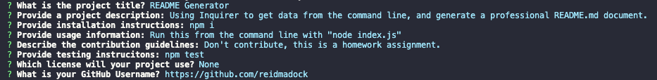

# README Generator

  ## Table of Contents
  - [Installation](#installation)
  - [Usage](#usage)
  - [Screenshot](#screenshot)
  - [License](#license)
  
  ## Description
  Using Node.JS and Inquirer to get data from the command line, and generate a professional README.md document. This README.md was generated, however also edited after to adjust what needs to be in it. It would be ideal if the application was more flexible. Perhaps that's a good future project.
  
  ## Installation
  Installations required:  
  npm i
  
  ## Usage
  Run this from the command line with "node index.js"

  ## Link
  This app is not live on GitHub Pages, because it has no backend.
  
  ## Screenshot
  Here is a screenshot of the application running.   
  
  ## Contact me
  Here is my [GitHub Profile](https://github.com/reidmadock)  
  - - -
  ## License
  Distributed under the [None]()  
    
    
